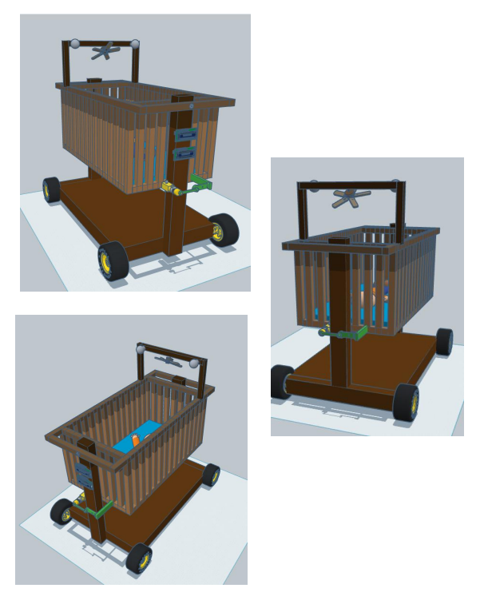
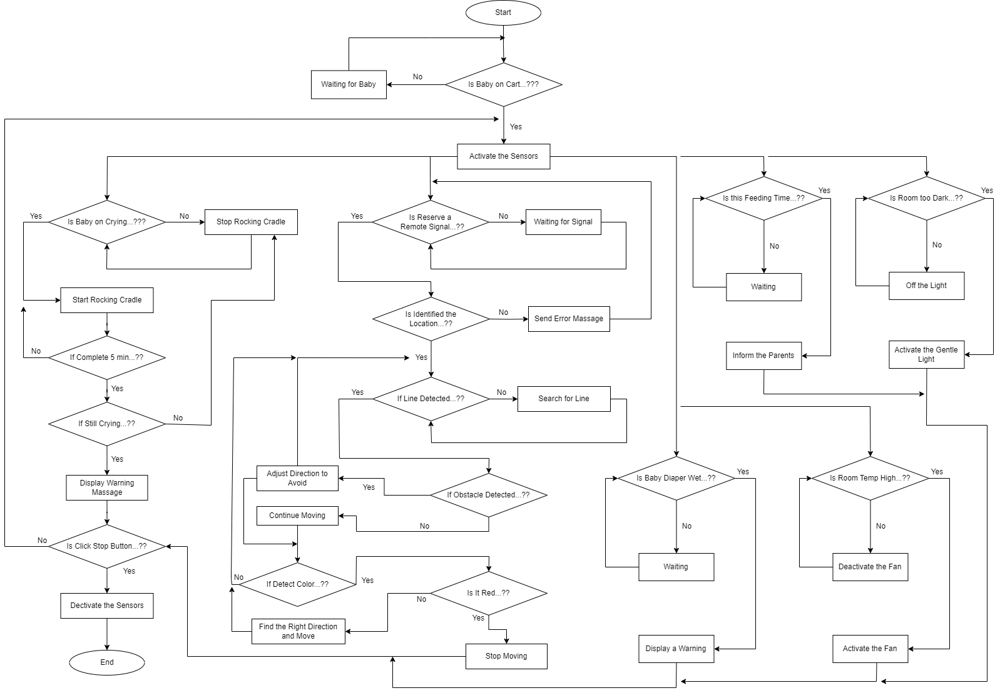

# Baby Caring Robot

## Project Overview

This project focuses on building a Baby Caring Robot designed to assist parents in managing childcare more efficiently. In today's busy social environment, parents often face challenges in providing continuous care for their babies. The primary goal of this project is to reduce parental stress and improve childcare efficiency.

## Problems Addressed

1. **Missed Crying Moments**  
   Parents may not hear the baby crying if they are in another room or busy.

2. **Stressful Baby Soothing**  
   Finding the right way to calm a crying baby can be time-consuming and stressful.

3. **Maintaining Baby’s Comfort**  
   Parents may struggle to keep the baby’s environment comfortable, including temperature and humidity.

4. **Light Sensitivity**  
   Babies may feel uneasy in the dark or be disturbed by harsh light.

5. **Continuous Attention Demands**  
   Parents often feel overwhelmed by the need for continuous baby care.

6. **Sleep Deprivation for Parents**  
   Repeated waking to attend to the baby can lead to sleep deprivation for parents.

7. **Identifying Diaper Changes**  
   Parents may struggle to identify whether the baby's diaper is wet or soiled.

8. **Missed Feeding Times**  
   Busy parents may forget feeding times, affecting the baby’s routine and nutrition.

9. **Challenges in Monitoring and Bringing the Baby Cradle to Parents Remotely**  
   In busy households, parents may find it difficult to leave their work or tasks to attend to their baby, especially when they need the cradle to come closer but cannot move themselves.

## Solutions Implemented

1. **Cry Detection and Soothing System**  
   The robot detects the baby’s cry using a microphone sensor and automatically activates a rocking motion to gently rock the cradle and triggers soothing toys, providing additional comfort to calm the baby.

2. **Environment Monitoring and Control System**  
   The robot continuously monitors the room’s temperature and humidity. If the environment becomes uncomfortable, it automatically activates a fan to adjust the temperature, ensuring a comfortable atmosphere for the baby.

3. **Gentle Night Light System**  
   The robot features a soft, adjustable night light that provides just enough illumination without disturbing the baby’s sleep, creating a soothing environment.

4. **Feeding Time Reminder System**  
   The robot includes a clock-based reminder system that notifies parents when it’s time for the baby’s next feeding, ensuring the baby’s nutrition schedule is maintained.

5. **Diaper Condition Check**  
   Using moisture sensors, the robot can detect if the baby’s diaper is wet or soiled and send an alert to the parents, ensuring timely diaper changes.

6. **Automated Baby Cradle with Remote Accessibility**  
   By integrating motorized movement with obstacle avoidance, line-following capabilities, and smartphone-based controls into the cradle system, parents can summon the cradle to their location at the press of a button on their phone, ensuring convenience and peace of mind.

## Flow Chart

## Conclusion

The Baby Caring Robot is an innovative solution designed to address common challenges faced by parents in childcare. By automating routine tasks and providing timely alerts, this robot aims to enhance the overall childcare experience, allowing parents to focus on other responsibilities while ensuring their baby's needs are met efficiently.
